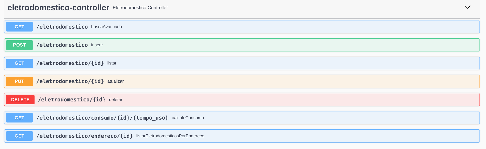

# Documentação da API de Gestão de Eletrodomésticos 

## Propósito
Permitir o cadastro e gerenciamento de informações sobre os aparelhos eletrônicos dos usuários cadastrados em nosso sistema

## Objetivos (Fase 2)
Receber as informações dos eletrônicos com os campos de nome, modelo, potência e outros dados relevantes com os seguintes requisitos:
1. O verbo POST deve ser alterado para gravar os dados recebidos no um banco de dados seguro, associando o aparelho ao usuário que está cadastrando-o.
2. As informações devem ser validadas para garantir que elas estão no formato correto e que são válidas.    
3. Caso haja algum erro, a API deve retornar uma mensagem de erro indicando o problema encontrado. 
4. Os verbos GET, PUT e DELETE devem ser desenvolvidos para receber os dados, alterar os dados e remover os dados respectivamente.
5. Cada usuário pode ter vários aparelhos eletrônicos cadastrados em nosso sistema. 
6. A busca deve ser capaz de filtrar as informações por nome, modelo, potência ou outra informação relevante.
7. A atualização de informações deve permitir a edição de qualquer informação sobre o aparelho eletrônico.
8. A API de gestão de eletrodomésticos deve ser capaz de identificar os consumos de energia dos aparelhos eletrônicos cadastrados, com base no tempo de uso reportado pelo adaptador.
            
                  
## Endpoints
Swagger acessível através do endereço: [http://localhost:8080/swagger-ui/index.html#/eletrodomestico-controller](http://localhost:8080/swagger-ui/index.html#/eletrodomestico-controller)

### Para exemplos práticos de entrada e de validações consultar arquivo Postman:
[Enpoints e Validações no Postman](/postman/EletrodomesticoAPI.postman_collection.json)




<h3 style="background:rgba(73,204,144,.1)" dispay=block;>        <span style="background:#49cc90; color: #FFF; display:inline-block; padding: 6px 15px; border-radius:3px">POST</span>
<span style="color: #000">/eletrodomestico</span>
<sub style="color: #000; font-size: 15px; display: inline-block; margin-left: 10px" >inserir</sub>
</h3>

### Descrição
Recebe uma representação de eletrodoméstico no formato json com os seguintes campos
 - idEndereco - Long
 - modelo - String
 - nome - String
 - potencia - Double

### Exemplos de entrada e saída

**Entrada Esperada**
```json
{
  "idEndereco": 0,
  "modelo": "string",
  "nome": "string",
  "potencia": 0
}
```
**Saída - Código 200 OK**
```json
{
  "endereco": {
    "bairro": "string",
    "cidade": "string",
    "eletromesticos": [
      null
    ],
    "estado": "string",
    "id": 0,
    "numero": 0,
    "pessoas": [
      {
        "dataNascimento": "2023-09-03",
        "id": 0,
        "nome": "string",
        "parentesco": "string",
        "sexo": "string"
      }
    ],
    "rua": "string"
  },
  "id": 0,
  "modelo": "string",
  "nome": "string",
  "potencia": 0
}
```


<h3 style="background:rgba(97,175,254,.1)" dispay=block;>        <span style="background:#61affe; color: #FFF; display:inline-block; padding: 6px 15px; border-radius:3px">GET</span>
<span style="color: #000">/eletrodomestico/{id}</span>
<sub style="color: #000; font-size: 15px; display: inline-block; margin-left: 10px" >listar</sub>
</h3>

### Descrição
Recebe um id como Path Parameter e retorna o respectivo eletrodomestico corresponente a esse id
### Exemplos de entrada e saída

**Entrada Esperada**
```
/eletrodomestico/1
```
**Saída - Código 200 OK**
```json
{
  "endereco": {
    "bairro": "string",
    "cidade": "string",
    "eletromesticos": [
      null
    ],
    "estado": "string",
    "id": 0,
    "numero": 0,
    "pessoas": [
      {
        "dataNascimento": "2023-09-03",
        "id": 0,
        "nome": "string",
        "parentesco": "string",
        "sexo": "string"
      }
    ],
    "rua": "string"
  },
  "id": 0,
  "modelo": "string",
  "nome": "string",
  "potencia": 0
}
```

<h3 style="background:rgba(97,175,254,.1)" dispay=block;>        <span style="background:#61affe; color: #FFF; display:inline-block; padding: 6px 15px; border-radius:3px">GET</span>
<span style="color: #000">/eletrodomestico</span>
<sub style="color: #000; font-size: 15px; display: inline-block; margin-left: 10px" >busca Avancada</sub>
</h3>

### Descrição
Recebe qualquer combinação entre nome, modelo e potencia como Query Parameter e retorna o respectivo eletrodomestico corresponente a essa combinação
### Exemplos de entrada e saída

**Entradas Esperadas (lista não exaustiva)**
```
/eletrodomestico?nome=teste
/eletrodomestico?modelo=teste
/eletrodomestico?nome=teste?modelo=teste?potencia=10.0
```
**Saída - Código 200 OK**
```json
{
  "endereco": {
    "bairro": "string",
    "cidade": "string",
    "eletromesticos": [
      null
    ],
    "estado": "string",
    "id": 0,
    "numero": 0,
    "pessoas": [
      {
        "dataNascimento": "2023-09-03",
        "id": 0,
        "nome": "string",
        "parentesco": "string",
        "sexo": "string"
      }
    ],
    "rua": "string"
  },
  "id": 0,
  "modelo": "string",
  "nome": "string",
  "potencia": 0
}
```

<h3 style="background:rgba(97,175,254,.1)" dispay=block;>        <span style="background:#61affe; color: #FFF; display:inline-block; padding: 6px 15px; border-radius:3px">GET</span>
<span style="color: #000">/eletrodomestico/consumo/{id}/{tempo_uso}</span>
<sub style="color: #000; font-size: 15px; display: inline-block; margin-left: 10px" >calculo Consumo</sub>
</h3>

### Descrição
Recebe um id e o tempo de uso como Path Parameters e retorna o respectivo consumo de um dado eletrodoméstico
### Exemplos de entrada e saída

**Entrada Esperada**
```
/eletrodomestico/1/10.5
```
**Saída - Código 200 OK**
```json
{
  "consumo": 0
}
```


<h3 style="background:rgba(97,175,254,.1)" dispay=block;>        <span style="background:#61affe; color: #FFF; display:inline-block; padding: 6px 15px; border-radius:3px">GET</span>
<span style="color: #000">/eletrodomestico/endereco/{id}</span>
<sub style="color: #000; font-size: 15px; display: inline-block; margin-left: 10px" >listar Eletrodomesticos Por Endereco</sub>
</h3>

### Descrição
Recebe um id como Path Parameter e retorna uma lista com os eletrodomésticos associados ao endereço que corresponda a esse id
### Exemplos de entrada e saída

**Entrada Esperada**
```
/eletrodomestico/endereco/1
```
**Saída - Código 200 OK**
```json
[
  {
    "endereco": {
      "bairro": "string",
      "cidade": "string",
      "eletromesticos": [
        null
      ],
      "estado": "string",
      "id": 0,
      "numero": 0,
      "pessoas": [
        {
          "dataNascimento": "2023-09-03",
          "id": 0,
          "nome": "string",
          "parentesco": "string",
          "sexo": "string"
        }
      ],
      "rua": "string"
    },
    "id": 0,
    "modelo": "string",
    "nome": "string",
    "potencia": 0
  }
]
```

<h3 style="background:rgba(252,161,48,.1)" dispay=block;>        <span style="background:#fca120; color: #FFF; display:inline-block; padding: 6px 15px; border-radius:3px">PUT</span>
<span style="color: #000">/eletrodomestico/{id}</span>
<sub style="color: #000; font-size: 15px; display: inline-block; margin-left: 10px" >atualizar</sub>
</h3>

### Descrição
Recebe um eletrodoméstico no formato json com os seguintes campos e um id como Path Parameter que indica qual eletrodoméstico será atualizado
 - idEndereco - Long
 - modelo - String
 - nome - String
 - potencia - Double

### Exemplos de entrada e saída

**Entrada Esperada**
```json
/eletrodomestico/0
{
  "idEndereco": 2,
  "modelo": "string alterado",
  "nome": "string alterado",
  "potencia": 4.0
}
```
**Saída - Código 200 OK**
```json
{
  "endereco": {
    "bairro": "string",
    "cidade": "string",
    "eletromesticos": [
      null
    ],
    "estado": "string",
    "id": 0,
    "numero": 0,
    "pessoas": [
      {
        "dataNascimento": "2023-09-03",
        "id": 0,
        "nome": "string",
        "parentesco": "string",
        "sexo": "string"
      }
    ],
    "rua": "string"
  },
  "id": 0,
  "modelo": "string",
  "nome": "string",
  "potencia": 0
}
```
<h3 style="background:rgba(249,62,62,.1)" dispay=block;>        <span style="background:#f93e3e; color: #FFF; display:inline-block; padding: 6px 15px; border-radius:3px">DELETE</span>
<span style="color: #000">/eletrodomestico/{id}</span>
<sub style="color: #000; font-size: 15px; display: inline-block; margin-left: 10px" >deletar</sub>
</h3>

### Descrição
Recebe um Id via Path Parameter e deleta o recurso correspondente ao ID
```
/eletrodomestico/1
```
**Saída - Código 204 No Content**
