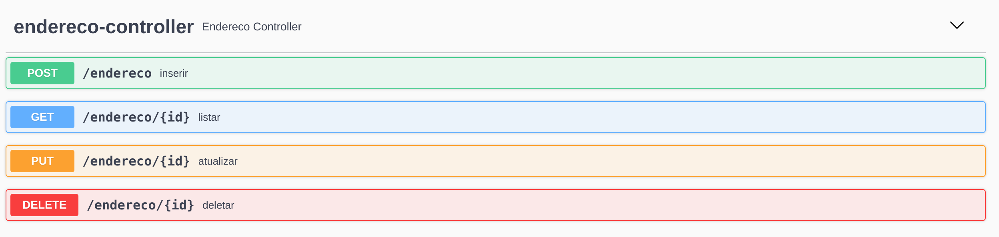

# Documentação da API de Cadastro de Endereços
---
## Propósito
Permitir o gerenciamento de informações sobre os endereços cadastrados em nosso sistema

## Objetivos
Receber as informações dos endereços com os campos de rua, número, bairro, cidade e estado com os seguintes requisitos:
1. Receber as solicitações em formato HTTP POST.
2. As informações devem ser validadas para garantir que elas estão no formato correto e que são válidas.    
3. Caso haja algum erro, a API deve retornar uma mensagem de erro indicando o problema encontrado.
4. Uma vez validadas as informações, a API deve informar que está tudo ok e dar um retorno positivo ao usuário.
                  
## Endpoints
Swagger acessível através do endereço: [http://localhost:8080/swagger-ui/index.html#/endereco-controller]

### Para exemplos práticos de entrada e de validações consultar arquivo Postman:
[Enpoints e Validações no Postman](/postman/EnderecosAPI.postman_collection.json)



<h3 style="background:rgba(73,204,144,.1)" dispay=block;>        <span style="background:#49cc90; color: #FFF; display:inline-block; padding: 6px 15px; border-radius:3px">POST</span>
<span style="color: #000">/endereco</span>
<sub style="color: #000; font-size: 15px; display: inline-block; margin-left: 10px" >inserir</sub>
</h3>

### Descrição
Recebe uma representação de endereço no formato json com os seguintes campos
 - rua - String
 - número - Double
 - bairro - String
 - cidade - String
 - estado - String

###Exemplos de entrada e saída

**Entrada Esperada**
```json
{
  "bairro": "string",
  "cidade": "string",
  "estado": "string",
  "numero": 0,
  "rua": "string"
}
```
**Saída - Código 200 OK**
```json
{
  "bairro": "string",
  "cidade": "string",
  "estado": "string",
  "id": 0,
  "numero": 0,
  "rua": "string"
}
```


<h3 style="background:rgba(97,175,254,.1)" dispay=block;>        <span style="background:#61affe; color: #FFF; display:inline-block; padding: 6px 15px; border-radius:3px">GET</span>
<span style="color: #000">/endereco/{id}</span>
<sub style="color: #000; font-size: 15px; display: inline-block; margin-left: 10px" >listar</sub>
</h3>
### Descrição
Recebe um id como Path Parameter e retorna o respectivo endereço corresponente a esse id
###Exemplos de entrada e saída

**Entrada Esperada**
```
/endereco/1
```
**Saída - Código 200 OK**
```json
{
  "bairro": "string",
  "cidade": "string",
  "estado": "string",
  "id": 1,
  "numero": 0,
  "rua": "string"
}
```
<h3 style="background:rgba(252,161,48,.1)" dispay=block;>        <span style="background:#fca120; color: #FFF; display:inline-block; padding: 6px 15px; border-radius:3px">PUT</span>
<span style="color: #000">/endereco/{id}</span>
<sub style="color: #000; font-size: 15px; display: inline-block; margin-left: 10px" >atualizar</sub>
</h3>
### Descrição
Recebe um endereço no formato json com os seguintes campos e um id como Path Parameter que indica qual endereço será atualizado
 - rua - String
 - número - Double
 - bairro - String
 - cidade - String
 - estado - String

###Exemplos de entrada e saída

**Entrada Esperada**
```json
/endereco/1
{
  "bairro": "string",
  "cidade": "string",
  "estado": "string",
  "numero": 0,
  "rua": "string"
}
```
**Saída - Código 200 OK**
```json
{
  "bairro": "string",
  "cidade": "string",
  "estado": "string",
  "id": 1,
  "numero": 0,
  "rua": "string"
}
```
<h3 style="background:rgba(249,62,62,.1)" dispay=block;>        <span style="background:#f93e3e; color: #FFF; display:inline-block; padding: 6px 15px; border-radius:3px">DELETE</span>
<span style="color: #000">/endereco/{id}</span>
<sub style="color: #000; font-size: 15px; display: inline-block; margin-left: 10px" >deletar</sub>
</h3>
### Descrição
Recebe um Id via Path Parameter e deleta o recurso correspondente ao ID
```
/endereco/1
```
**Saída - Código 204 No Content**