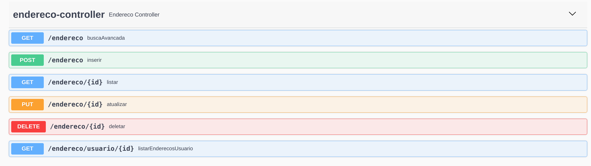

# Documentação da API de Cadastro de Endereços

## Propósito
Permitir o gerenciamento de informações sobre os endereços cadastrados em nosso sistema

## Objetivos
Receber as informações dos endereços com os campos de rua, número, bairro, cidade e estado com os seguintes requisitos:
1. O verbo POST deve ser alterado para gravar os dados recebidos no um banco de dados seguro, associando o endereço ao usuário que está cadastrando-o.
2. As informações devem ser validadas para garantir que elas estão no formato correto e que são válidas.    
3. Os verbos GET, PUT e DELETE devem ser desenvolvidos para receber os dados, alterar os dados e remover os dados respectivamente;
4. Caso haja algum erro, a API deve retornar uma mensagem de erro indicando o problema encontrado.
5. Cada usuário pode ter mais de um endereço cadastrado em nosso sistema.
6. A busca deve ser capaz de filtrar as informações por rua, bairro, cidade ou outra informação relevante.
7. A atualização de informações deve permitir a edição de qualquer informação sobre o endereço.
8. Essa API deve ser capaz de identificar as pessoas associadas a cada endereço cadastrado. Isso permitirá a criação de relacionamentos familiares entre os membros da casa e seus respectivos endereços.
9. Essa API deve ser capaz de identificar as pessoas associadas a cada endereço e vice-versa. 
                  
## Endpoints
Swagger acessível através do endereço: [http://localhost:8080/swagger-ui/index.html#/endereco-controller](http://localhost:8080/swagger-ui/index.html#/endereco-controller)

### Para exemplos práticos de entrada e de validações consultar arquivo Postman:
[Enpoints e Validações no Postman](/postman/EnderecosAPI.postman_collection.json)



<h3 style="background:rgba(73,204,144,.1)" dispay=block;>        <span style="background:#49cc90; color: #FFF; display:inline-block; padding: 6px 15px; border-radius:3px">POST</span>
<span style="color: #000">/endereco</span>
<sub style="color: #000; font-size: 15px; display: inline-block; margin-left: 10px" >inserir</sub>
</h3>

### Descrição
Recebe uma representação de endereço no formato json com os seguintes campos
 - IdUduario - Long
 - rua - String
 - número - Long
 - bairro - String
 - cidade - String
 - estado - String

### Exemplos de entrada e saída

**Entrada Esperada**
```json
{
  "idUsuario" : 1,
  "bairro": "string",
  "cidade": "string",
  "estado": "string",
  "idUsuario": 0,
  "numero": 0,
  "rua": "string"
}
```
**Saída - Código 200 OK**
```json
{
    "id": 8,
    "rua": "rua teste",
    "numero": 40,
    "bairro": "Bangu",
    "cidade": "Rio de Janeiro",
    "estado": "Rio de Janeiro"
}
```


<h3 style="background:rgba(97,175,254,.1)" dispay=block;>        <span style="background:#61affe; color: #FFF; display:inline-block; padding: 6px 15px; border-radius:3px">GET</span>
<span style="color: #000">/endereco/{id}</span>
<sub style="color: #000; font-size: 15px; display: inline-block; margin-left: 10px" >listar</sub>
</h3>
### Descrição
Recebe um id como Path Parameter e retorna o respectivo endereço corresponente a esse id
###Exemplos de entrada e saída

**Entrada Esperada**
```
/endereco/1
```
**Saída - Código 200 OK**
```json
{
  "bairro": "string",
  "cidade": "string",
  "eletromesticos": [
    {
      "id": 0,
      "modelo": "string",
      "nome": "string",
      "potencia": 0
    }
  ],
  "estado": "string",
  "id": 0,
  "numero": 0,
  "pessoas": [
    {
      "dataNascimento": "2023-09-03",
      "id": 0,
      "nome": "string",
      "parentesco": "string",
      "sexo": "string"
    }
  ],
  "rua": "string"
}
```

<h3 style="background:rgba(97,175,254,.1)" dispay=block;>        <span style="background:#61affe; color: #FFF; display:inline-block; padding: 6px 15px; border-radius:3px">GET</span>
<span style="color: #000">/endereco/usuario/{id}</span>
<sub style="color: #000; font-size: 15px; display: inline-block; margin-left: 10px" >listar Enderecos Usuario</sub>
</h3>
### Descrição
Recebe um id como Path Parameter e retorna os respectivos endereços corresponentes ao usuário que possuir esse id
###Exemplos de entrada e saída

**Entrada Esperada**
```
/endereco/usuario/1
```
**Saída - Código 200 OK**
```json
[
  {
    "bairro": "string",
    "cidade": "string",
    "eletromesticos": [
      {
        "id": 0,
        "modelo": "string",
        "nome": "string",
        "potencia": 0
      }
    ],
    "estado": "string",
    "id": 0,
    "numero": 0,
    "pessoas": [
      {
        "dataNascimento": "2023-09-03",
        "id": 0,
        "nome": "string",
        "parentesco": "string",
        "sexo": "string"
      }
    ],
    "rua": "string"
  }
]
```

<h3 style="background:rgba(97,175,254,.1)" dispay=block;>        <span style="background:#61affe; color: #FFF; display:inline-block; padding: 6px 15px; border-radius:3px">GET</span>
<span style="color: #000">/endereco</span>
<sub style="color: #000; font-size: 15px; display: inline-block; margin-left: 10px" >busca avançada</sub>
</h3>
### Descrição
Recebe qualquer combinação entre bairro, cidade, estado, numero e rua como Query Parameter e retorna a lista com os respectivos endereços corresponentes a essa combinação
###Exemplos de entrada e saída

**Entrada Esperada**
```
/endereco?bairro=teste
/endereco?cidade=teste
/endereco?estado=teste
/endereco?rua=teste
/endereco?bairro=teste&cidade=teste&rua=teste
```
**Saída - Código 200 OK**
```json
[
  {
    "bairro": "string",
    "cidade": "string",
    "eletromesticos": [
      {
        "id": 0,
        "modelo": "string",
        "nome": "string",
        "potencia": 0
      }
    ],
    "estado": "string",
    "id": 0,
    "numero": 0,
    "pessoas": [
      {
        "dataNascimento": "2023-09-03",
        "id": 0,
        "nome": "string",
        "parentesco": "string",
        "sexo": "string"
      }
    ],
    "rua": "string"
  }
]
```

<h3 style="background:rgba(252,161,48,.1)" dispay=block;>        <span style="background:#fca120; color: #FFF; display:inline-block; padding: 6px 15px; border-radius:3px">PUT</span>
<span style="color: #000">/endereco/{id}</span>
<sub style="color: #000; font-size: 15px; display: inline-block; margin-left: 10px" >atualizar</sub>
</h3>
### Descrição
Recebe um endereço no formato json com os seguintes campos e um id como Path Parameter que indica qual endereço será atualizado
 - idUsuario - Long
 - rua - String
 - número - Double
 - bairro - String
 - cidade - String
 - estado - String

###Exemplos de entrada e saída

**Entrada Esperada**
/endereco/1
```json
{
    "id": 1,
    "rua": "rua teste alterada",
    "numero": 50,
    "bairro": "Bairro alterado",
    "cidade": "Rio de Janeiro alterado",
    "estado": "Rio de Janeiro alterado"
}
```
<h3 style="background:rgba(249,62,62,.1)" dispay=block;>        <span style="background:#f93e3e; color: #FFF; display:inline-block; padding: 6px 15px; border-radius:3px">DELETE</span>
<span style="color: #000">/endereco/{id}</span>
<sub style="color: #000; font-size: 15px; display: inline-block; margin-left: 10px" >deletar</sub>
</h3>

### Descrição
Recebe um Id via Path Parameter e deleta o recurso correspondente ao ID
```
/endereco/1
```

**Saída - Código 204 No Content**
