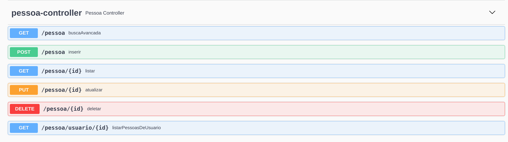

# Documentação da API de Gestão de Pessoas

## Propósito
Permitir o cadastro e gerenciamento de informações sobre as pessoas relacionadas aos usuários cadastrados em nosso sistema

## Objetivos
Receber as informações das pessoas com os campos de nome, data de nascimento, sexo, parentesco com o usuário e outros dados relevantes com os seguintes requisitos:
1.  O verbo POST deve ser alterado para gravar os dados recebidos no um banco de dados seguro, associando a pessoa ao usuário que está cadastrando-a.
2. As informações devem ser validadas para garantir que elas estão no formato correto e que são válidas.    
3. Cada usuário pode ter várias pessoas relacionadas cadastradas em nosso sistema. 
4. Os verbos GET, PUT e DELETE devem ser desenvolvidos para receber os dados, alterar os dados e remover os dados respectivamente;
5. A busca deve ser capaz de filtrar as informações por nome, parentesco, sexo ou outra informação relevante. 
6. A atualização de informações deve permitir a edição de qualquer informação sobre a pessoa. 
7. A API deve ser capaz de identificar os relacionamentos entre as pessoas cadastradas. Isso permitirá a criação de relacionamentos familiares entre os membros da casa, como pai, mãe, irmão, etc.
8. A API deve ser capaz de identificar os relacionamentos e gerar outros relacionamentos automaticamente, com base na lógica de relacionamentos. 
                  
## Endpoints
Swagger acessível através do endereço: [http://localhost:8080/swagger-ui/index.html#/pessoa-controller](http://localhost:8080/swagger-ui/index.html#/pessoa-controller)

### Para exemplos práticos de entrada e de validações consultar arquivo Postman:
[Enpoints e Validações no Postman](/postman/PessoaAPI.postman_collection.json)



<h3 style="background:rgba(73,204,144,.1)" dispay=block;>        <span style="background:#49cc90; color: #FFF; display:inline-block; padding: 6px 15px; border-radius:3px">POST</span>
<span style="color: #000">/pessoa</span>
<sub style="color: #000; font-size: 15px; display: inline-block; margin-left: 10px" >inserir</sub>
</h3>

### Descrição
Recebe uma representação de pessoa no formato json com os seguintes campos
 - dataNascimento - LocalDate
 - idUsuario - Long
 - nome - String
 - parentesco - String
 - sexo - String

### Exemplos de entrada e saída

**Entrada Esperada**
```json
{
  "dataNascimento": "2021-06-16",
  "idEndereco": 0,
  "nome": "string",
  "parentesco": "string",
  "sexo": "string"
}
```
**Saída - Código 200 OK**
```json
{
  "dataNascimento": "2023-09-03",
  "endereco": {
    "bairro": "string",
    "cidade": "string",
    "eletromesticos": [
      {
        "id": 0,
        "modelo": "string",
        "nome": "string",
        "potencia": 0
      }
    ],
    "estado": "string",
    "id": 0,
    "numero": 0,
    "pessoas": [
      null
    ],
    "rua": "string"
  },
  "id": 0,
  "nome": "string",
  "parentesco": "string",
  "sexo": "string"
}
```


<h3 style="background:rgba(97,175,254,.1)" dispay=block;>        <span style="background:#61affe; color: #FFF; display:inline-block; padding: 6px 15px; border-radius:3px">GET</span>
<span style="color: #000">/pessoa/{id}</span>
<sub style="color: #000; font-size: 15px; display: inline-block; margin-left: 10px" >listar</sub>
</h3>

### Descrição
Recebe um id como Path Parameter e retorna a respectiva pessoa corresponente a esse id
### Exemplos de entrada e saída

**Entrada Esperada**
```
/pessoa/1
```
**Saída - Código 200 OK**
```json
{
  "dataNascimento": "2023-09-03",
  "endereco": {
    "bairro": "string",
    "cidade": "string",
    "eletromesticos": [
      {
        "id": 0,
        "modelo": "string",
        "nome": "string",
        "potencia": 0
      }
    ],
    "estado": "string",
    "id": 0,
    "numero": 0,
    "pessoas": [
      null
    ],
    "rua": "string"
  },
  "id": 0,
  "nome": "string",
  "parentesco": "string",
  "sexo": "string"
}
```
<h3 style="background:rgba(97,175,254,.1)" dispay=block;>        <span style="background:#61affe; color: #FFF; display:inline-block; padding: 6px 15px; border-radius:3px">GET</span>
<span style="color: #000">/pessoa</span>
<sub style="color: #000; font-size: 15px; display: inline-block; margin-left: 10px" >busca Avancada</sub>
</h3>

### Descrição
Recebe qualquer combinação entre nome, date, parentesco e sexo como Query Parameter e retorna as pessoas corresponentes a essa combinação
### Exemplos de entrada e saída

**Entradas Esperadas (lista não exaustiva)**
```
/pessoa?nome=teste
/pessoa?parentesco=primo
/pessoa?date=2023-09-03
/pessoa?nome=teste?parentesco=irmao
```
**Saída - Código 200 OK**
```json
[
  {
    "dataNascimento": "2023-09-03",
    "endereco": {
      "bairro": "string",
      "cidade": "string",
      "eletromesticos": [
        {
          "id": 0,
          "modelo": "string",
          "nome": "string",
          "potencia": 0
        }
      ],
      "estado": "string",
      "id": 0,
      "numero": 0,
      "pessoas": [
        null
      ],
      "rua": "string"
    },
    "id": 0,
    "nome": "string",
    "parentesco": "string",
    "sexo": "string"
  }
]
```


<h3 style="background:rgba(97,175,254,.1)" dispay=block;>        <span style="background:#61affe; color: #FFF; display:inline-block; padding: 6px 15px; border-radius:3px">GET</span>
<span style="color: #000">/pessoa/usuario/{id}</span>
<sub style="color: #000; font-size: 15px; display: inline-block; margin-left: 10px" >listar Pessoas de Usuario</sub>
</h3>

### Descrição
Recebe um id como Path Parameter e retorna uma lista com as pessoas associadas ao usuário que corresponda a esse id
### Exemplos de entrada e saída

**Entrada Esperada**
```
/pessoa/usuario/1
```
**Saída - Código 200 OK**
```json
[
  {
    "dataNascimento": "2023-09-03",
    "endereco": {
      "bairro": "string",
      "cidade": "string",
      "eletromesticos": [
        {
          "id": 0,
          "modelo": "string",
          "nome": "string",
          "potencia": 0
        }
      ],
      "estado": "string",
      "id": 0,
      "numero": 0,
      "pessoas": [
        null
      ],
      "rua": "string"
    },
    "id": 0,
    "nome": "string",
    "parentesco": "string",
    "sexo": "string"
  }
]
```

<h3 style="background:rgba(252,161,48,.1)" dispay=block;>        <span style="background:#fca120; color: #FFF; display:inline-block; padding: 6px 15px; border-radius:3px">PUT</span>
<span style="color: #000">/pessoa/{id}</span>
<sub style="color: #000; font-size: 15px; display: inline-block; margin-left: 10px" >atualizar</sub>
</h3> 

### Descrição
Recebe uma pessoa no formato json com os seguintes campos e um id como Path Parameter que indica qual pessoa será atualizada
 - dataNascimento - LocalDate
 - idEndereco - Long
 - nome - String
 - parentesco - String
 - sexo - String

### Exemplos de entrada e saída

**Entrada Esperada**
```json
/pessoa/1
{
  "dataNascimento": "2020-06-16",
  "idEndereco": 0,
  "nome": "string alterado",
  "parentesco": "string alterado",
  "sexo": "string alterado"
}
```
**Saída - Código 200 OK**
```json
{
  "dataNascimento": "2023-09-03",
  "endereco": {
    "bairro": "string",
    "cidade": "string",
    "eletromesticos": [
      {
        "id": 0,
        "modelo": "string",
        "nome": "string",
        "potencia": 0
      }
    ],
    "estado": "string",
    "id": 0,
    "numero": 0,
    "pessoas": [
      null
    ],
    "rua": "string"
  },
  "id": 0,
  "nome": "string",
  "parentesco": "string",
  "sexo": "string"
}
```
<h3 style="background:rgba(249,62,62,.1)" dispay=block;>        <span style="background:#f93e3e; color: #FFF; display:inline-block; padding: 6px 15px; border-radius:3px">DELETE</span>
<span style="color: #000">/pessoa/{id}</span>
<sub style="color: #000; font-size: 15px; display: inline-block; margin-left: 10px" >deletar</sub>
</h3>

### Descrição
Recebe um Id via Path Parameter e deleta o recurso correspondente ao ID
```
/pessoa/1
```
**Saída - Código 204 No Content**
