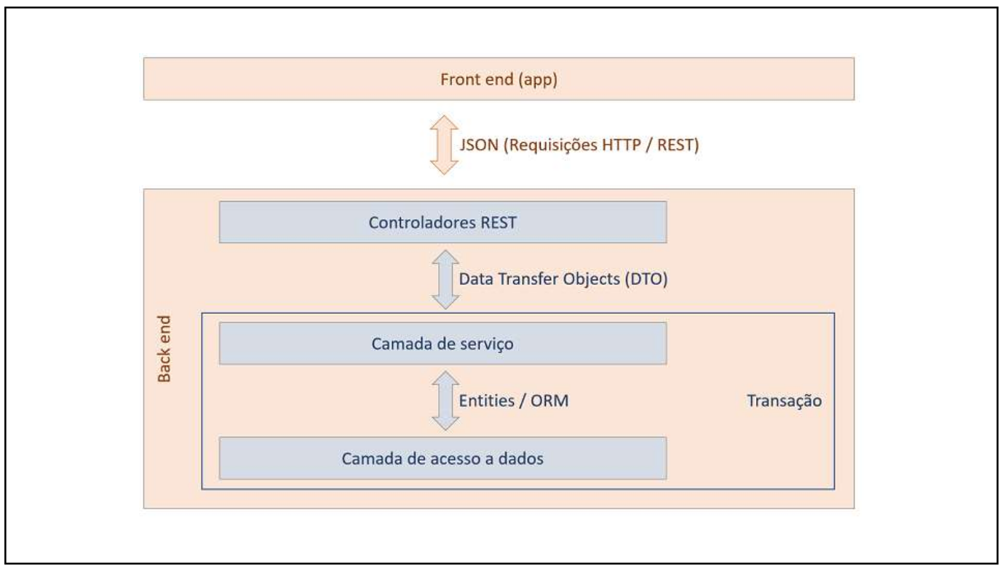

# Relatório Técnico da Fase 1

## Tecnologias, Frameworks e Bibliotecas Utilizadas 
- Java
- Postman
- Swagger
- Spring
- Lombok 
- JMapper
- Bean Validation

---

## Arquitetura Utilizada 

## DER 

## Desafios Encontrados / Soluções Apresentadas
### Desafio: Classe de domínio responsável por encapsular dados das requisições 
Como descrito nas aulas, temos dois grandes problemas advindos desse Desafio: 
1. Ferir o Single Responsability, prejudicando a arquitetura de nosso código e deixando mais difícil de dar manutenção e evoluir o código
2. Comprometer a segurança, uma vez que expor diretamente as entities nos deixa vulnerável ao [Mass Assignment](https://cheatsheetseries.owasp.org/cheatsheets/Mass_Assignment_Cheat_Sheet.html)

### Solução: Criar DTOs / Forms
Implementando DTOs para a recepção de dados do cliente e troca de dados entre a camada Controller e Service nos permite encapsular nossas entidades e fornecer uma representação própria dos dados que estamos expondo, esse encapsulamento nos protege do  [Mass Assignment](https://cheatsheetseries.owasp.org/cheatsheets/Mass_Assignment_Cheat_Sheet.html).
Outro benefício é permitir que tenhamos diversas representações de dados para uma mesmo recurso, de forma a permitir que o retorno do endpoint contenha apenas os dados necessários àquela requisição.

---
### Desafio: Necessidade de transformar os DTOs nas respectivas classes de domínio manualmente  
O desafio aqui reside na quantidade de trabalho e código necessário para realizar tarefas como: 
1. Transformar uma entidade para múltiplas representações DTO
2.  transformar uma entidade com muitos campos em um DTO (especialmente quando envolvem outras entidades aninhadas).  
3.  Fazer as operações inversas as anteriores (Entity-DTO)
### Solução: Introduzir um mapper (atualmente o Jmapper)
Há diversas bibliotecas que se propõe a realizar a tarefa de tranformar DTOs em entidades (e vice-versa). Optamos pelo JMapper para mantermos o alinhamento com o que foi passado no curso, mas cientes das limitações dela, principalmente em relação à versão do Java 

---
### Desafio: Necessidade de validar os dados de entrada, aplicando o Fail Fast 
Por motivos de segurança e integridade dos dados da aplicação, é necessário realizar validações nos dados que estão sendo submetidos na fronteira de nossa aplicação, garantindo que o formato esperado seja atendido nas requisições. Seguindo o Fail Fast, é importante que as requisições com dados inválidos falhem já na etapa inicial, dessa forma aumentando a performance e segurança pois evitamos que falhas se propaguem para as camadas de nível mais baixo. 
### Solução: Utilizar o Bean Validation
A fim de obter os benefícios declarados acima, utilizamos o Bean Validation para especificar as regras básicas de validação do formato dos dados recebidos na fronteira de nossa aplicação. Dessa forma, podemos realizar validações anotando diretamente nossos DTOs e retornar exatamente quais dados ferem essas regras de validação. 

[Bean validation Spec](https://beanvalidation.org/2.0-jsr380/)

[Implementação Hibernate](https://hibernate.org/validator/)

---
### Desafio: Necessidade de retirar as regras de negócio do Controller e desacoplar sua especificação de sua implementação 
Como boa prática, o Controller não deve assumir a responsabilidade de orquestrar os métodos negociais necessários para produzir o retorno de um dado Endpoint. 
O papel do Controller é atuar na fronteira da aplicação, expondo os métodos que a API disponibilizará e repassando as mensagens de requisição e resposta nos formatos especificados. 

### Solução: Utilizar o Service em nossa arquitetura e abstraí-lo no esquema interface / implementação 
A arquitetura escolhida para o sistema envolve utilizar o Service como camada responsável por fazer a orquestração dos métodos negociais necessários para produzir o retorno esperado pelo Controller, dessa maneira, o Controller fica com a responsabilidade especializada de atuar na fronteira da aplicação, expondo os métodos de nossa API, redirecionando as chamadas para o service e reencapsulando as respostas produzidas pelo service no formato do protocolo HTTP.

---
### Desafio: Tratar as exceçoes que são geradas através das quebras nas validações anteriormente definidas de forma a geramos exceções com maior semântica para os clientes de nossas APIs
As validações definidas no Bean Validation lançam exceções, que, se não forem capturadas e relançadas por nossa aplicação em um formato que traga mais semântica, irão sempre retornar erro 500 para o usuário, dando a entender que o erro está na parte do servidor e não nos dados fora do formato especificado.
### Solução: Criar classes responsáveis por capturar as exceções e transformá-las em mensagens com maior significado
A Solução adotada foi criarmos uma classe responsável por interceptar as exceções de validação lançadas, o Spring fornece um facilitador para isso através da anotação @ControllerAdvice, que permite interceptar as exceções lançadas por qualquer Bean geranciado pelo Spring.
Além disso, criamos classes para representar as exceções no formato HTTP.
Dessa forma, utilizamos métodos para tratar e relançar essas exceções no formato desejado, transformando o Response Status 500 genérico em Response Status 4xx, com as respesctivas falhas de validação cometidas pelo cliente.

---
### Desafio: Remover a limitação do Jmapper em relação ao Java 11 
A biblioteca Jmapper está em processo de descontinuidade, portanto, mantê-la limitaria todo o sistema ao Java 11. 

### Solução: Adotar o mapeamento de DTOs de forma manual 
Avaliamos outras soluções para realizar o mapeamento, como o ModelMapper. Porém, dada a baixa complexidade de nossas entidades, resolvemos não acoplar o sistema a uma implementação de mapper e realizarmos nós mesmos os mapeamentos. 

---
### Desafio: Criar o relacionamento de parentesco de maneira automática
Como desafio proposto na API de pessoas, foi sugerida a criação de relacionamentos entre pessoas de maneira automática, baseado no contexto do relacionamento entre a pessoa que está sendo adicionada em relação ao usuário que a está adicionando e no relacionamento entre as outras pessoas associadas a este mesmo usuário.

### Solução: abraçar a simplicidade e reduzir o escopo 
Entendo que esse não é um ponto crucial da aplicação, decidimos por não criar os relacionamentos de parentescos de maneira automática, dada a complexidade que parentescos não convencionais trariam, bem como a diversidade de configurações de famílias que a sociedade possui atualmente. Realizamos uma POC que pode ser consultada no endereço: Nela temos a criação automática de parentesco para PAIS, FILHOS, CONJUGES E IRMAOS. 

---

### Desafio: Criar queries que possibilitem uma grande combinação de diferentes filtros 
Um dos requisitos do desafio é implementar uma busca que aceite como parâmetro qualquer campo, bem como a combinação desses. Cobrir cada possibilidade implicaria em implementar diferentes buscas no Repository do Spring Data 

### Solução: Utilizar o Critearia API + Specification 
Decidimos por usar as Specifications do Spring Data para trazer maior flexibiliade e dinamicidade na criação das queries. 
[Specification](https://reflectoring.io/spring-data-specifications/)