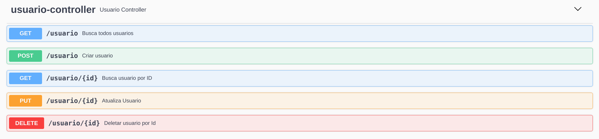

# Documentação da API de Cadastro de Usuários

## Propósito
Permitir o gerenciamento de informações sobre os usuários cadastrados em nosso sistema

## Objetivos
Servir de endpoint para o cadastro e gerenciamento de Usuários
                  
## Endpoints
Swagger acessível através do endereço: [http://localhost:8080/swagger-ui/index.html#/usuario-controller](http://localhost:8080/swagger-ui/index.html#/usuario-controller)

### Para exemplos práticos de entrada e de validações consultar arquivo Postman:
[Enpoints e Validações no Postman](https://github.com/vitorAlves1992/TechChallengeFiap/blob/fase2/postman/UsuarioAPI.postman_collection.json)



<h3 style="background:rgba(73,204,144,.1)" dispay=block;>        <span style="background:#49cc90; color: #FFF; display:inline-block; padding: 6px 15px; border-radius:3px">POST</span>
<span style="color: #000">/usuario</span>
<sub style="color: #000; font-size: 15px; display: inline-block; margin-left: 10px" >criar usuario</sub>
</h3>

### Descrição
Recebe uma representação de usuário no formato json com os seguintes campos
 - email - String


### Exemplos de entrada e saída

**Entrada Esperada**
```json
{
  "email": "string"
}
```
**Saída - Código 200 OK**
```json
{
  "email": "string",
  "id": 0
}
```


<h3 style="background:rgba(97,175,254,.1)" dispay=block;>        <span style="background:#61affe; color: #FFF; display:inline-block; padding: 6px 15px; border-radius:3px">GET</span>
<span style="color: #000">/usuario/{id}</span>
<sub style="color: #000; font-size: 15px; display: inline-block; margin-left: 10px" >buscar usuario por id</sub>
</h3>
### Descrição
Recebe um id como Path Parameter e retorna o respectivo usuário corresponente a esse id
###Exemplos de entrada e saída

**Entrada Esperada**
```
/usuario/1
```
**Saída - Código 200 OK**
```json
{
  "email": "string",
  "id": 0
}
```

<h3 style="background:rgba(97,175,254,.1)" dispay=block;>        <span style="background:#61affe; color: #FFF; display:inline-block; padding: 6px 15px; border-radius:3px">GET</span>
<span style="color: #000">/usuario</span>
<sub style="color: #000; font-size: 15px; display: inline-block; margin-left: 10px" >buscar todos os usuarios</sub>
</h3>
### Descrição
Lista todos os usuários do sistema
###Exemplos de entrada e saída

**Entrada Esperada**
```
/usuario
```
**Saída - Código 200 OK**
```json
[
  {
    "email": "string",
    "id": 0
  }
]
```


<h3 style="background:rgba(252,161,48,.1)" dispay=block;>        <span style="background:#fca120; color: #FFF; display:inline-block; padding: 6px 15px; border-radius:3px">PUT</span>
<span style="color: #000">/usuario/{id}</span>
<sub style="color: #000; font-size: 15px; display: inline-block; margin-left: 10px" >atualiza usuario</sub>
</h3>
### Descrição
Recebe um usuário no formato json com os seguintes campos e um id como Path Parameter que indica qual usuário será atualizado
 
 - email - String


###Exemplos de entrada e saída

**Entrada Esperada**
```json
/usuario/1
{
  "email": "string"
}
```
**Saída - Código 200 OK**
```json
{
  "email": "string",
  "id": 0
}
```
<h3 style="background:rgba(249,62,62,.1)" dispay=block;>        <span style="background:#f93e3e; color: #FFF; display:inline-block; padding: 6px 15px; border-radius:3px">DELETE</span>
<span style="color: #000">/usuario/{id}</span>
<sub style="color: #000; font-size: 15px; display: inline-block; margin-left: 10px" >deletar usuario por ID</sub>
</h3>

### Descrição
Recebe um Id via Path Parameter e deleta o recurso correspondente ao ID
```
/usuario/1
```

**Saída - Código 204 No Content**
